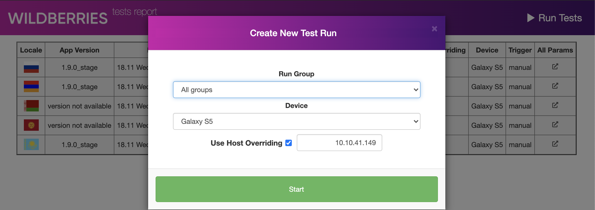
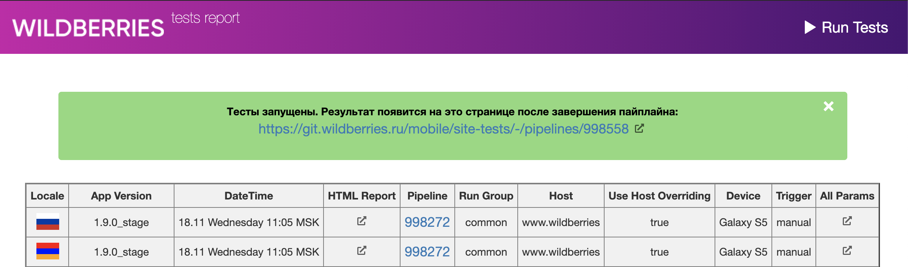
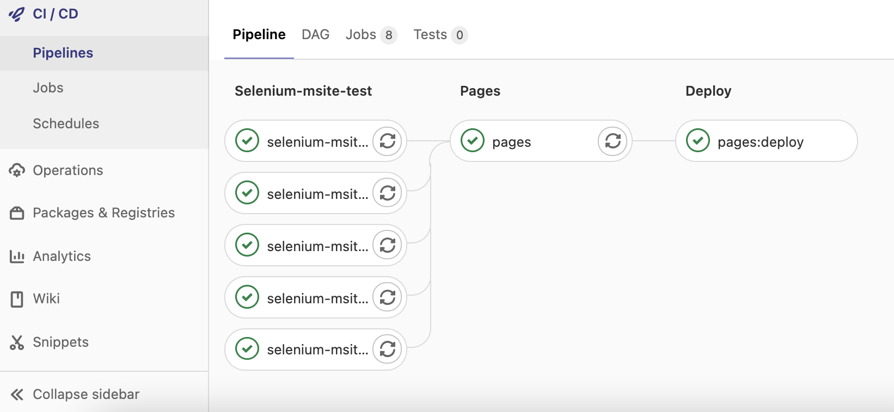
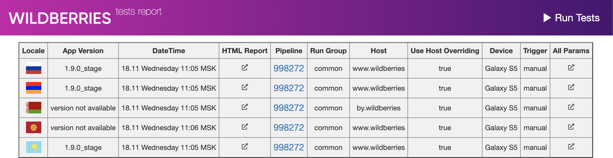

## Запуск
Самый простой способ запуска тестов - через WEB интерфейс:
http://mobile.git.wildberries.ru/site-tests/



Достаточно просто выбрать группу тестов, девайс и определить окружение для запуска.
(если галочка не установлена - запуск на проде, в противном случае хосты будут переопределены на указанный IP).
Тесты запустятся **одновременно на всех** доступных локалях.
Прогресс можно будет отследить по ссылке, которая отобразится после нажатия Start:



После завершения пайплайна, результат задеплоится на эту же страницу.
(**!Время** между завершением пайплайна и отображением результатов прогона **может достигать 15-и минут**)



Для другого способа запуска тестов, либо запуска в специфическом окружении доступна гибкая и простая конфигурация, описанная ниже.

## Конфигурация
`config.properties` - настройки по умолчанию.
`local.properties` - локальные настройки. **Только указанные явно** в этом файле параметры, перезаписывают параметры по умолчанию. 

**Пример local.properties**
```
LOCALE=kz
```

## Запуск локально
Для запуска локально необходимо установить и **запустить** _selenium-standalone_:
```
npm install selenium-standalone@latest -g
selenium-standalone install
selenium-standalone start
```
**ИЛИ** переключить параметр REMOTE в false и установить драйвер вручную. Например, chromedriver:
```
npm install chromedriver -g
```
в таком случае тесты запустятся в установленном локально инстансе браузера по адресу, указанному в параметре LOCAL конфигурационного файла.
По умолчанию:
```
LOCAL=http://localhost:3000
```

Необязательные параметры:
* $LOCALE - Локализация (по умолчанию: RU)
* $ENV_URL - Адрес тестируемой версии (по умолчанию: url, соответствующий локализации). Если данный параметр указан явно, то параметр LOCALE так же нужно будет указать явно или он будет переопределен в соответствии с доменом 1-го уровня указанного URL
* $DEVICE - Эмулируемое устройство. Параметр, передаваемый браузеру в режиме эмуляции мобильных устройств (по умолчанию: Galaxy S5)
* $THREAD_COUNT - Количество потоков, используемое для тестов (по умолчанию: 1)
* $GROUPS - Группы тестов через запятую (по умолчанию: все группы)

**Примеры запуска локально**
* `mvn clean test site`
* `mvn clean test site -DenvUrl=https://by.wildberries.ru -Ddevice="Nexus 5" -DthreadCount=5 -Dlocale=BY -Dgroup=catalog,search`

## GitLab Pipeline
Глобальные переменные:
* ENV_IP - IP тестового окружения
* ENV_OVERRIDE_HOST - Подмена хоста (true/false)
* RUN_GROUPS - Группы запускаемых тестов (через запятую)
* RUN_THREAD_COUNT - Количество потоков
* RUN_DEVICE - Эмулируемое устройство

**Параметры по умолчанию**
```
ENV_IP: "10.10.41.149"
ENV_OVERRIDE_HOST: "true"
RUN_GROUPS: ""
RUN_THREAD_COUNT: 1
RUN_DEVICE: "Galaxy S5"
```
Пайплайн запускается автоматически по триггерам:
* Коммит или мерж в master ветку приложения (https://git.wildberries.ru/mobile/site)
* Коммит или мерж в master ветку автотестов (https://git.wildberries.ru/mobile/site-tests)

или вручную:
* Через WEB интерфейс pages (http://mobile.git.wildberries.ru/site-tests)
* Через WEB интерфейс Gitlab CI (https://git.wildberries.ru/mobile/site-tests/-/pipelines/new)

## Отчет
**Постоянная ссылка на страницу отчетов:**

http://mobile.git.wildberries.ru/site-tests



**Генерация Allure отчета локально:**
`allure serve ./target/allure-results`

## Группы тестов

**Пример**
```
search - все тесты, так или иначе, связанные с поиском
catalog - тесты, связанные с каталогом
menu - тесты меню
```
**Все группы тестов перечислены в интерфейсе `ru.wildberries.utils.TestGroups`:**
```
basket
brands
catalog
checkout
common
filters-sorting
home-page
menu
my-groups
notifications
ordering
poned
popup
product-card
product-count
product-not-available
product-price
redirects
search
search-suggest
waiting-list
with-auth
without-auth
```

## Локализация и URL тестового окружения
Маппинг локали и соответствующего ему тестового окружения описан в enum-е:
```
ru.wildberries.enums.site.EnvironmentUrl
```